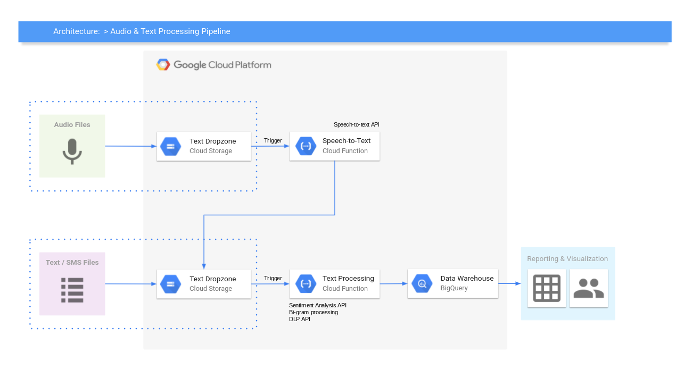

## Audio & Text Processing Pipeline

This repo contains code, deployed on Google Cloud services, that processes audio and text files. 

Reference Architecture:


## Getting Started

1. Clone the repo. 
2. Deploy the GCP services. The following command will setup Google Cloud Storage buckets, BigQuery datasets and tables, and deploy the Cloud Functions. 
    ```
    ./deploy_to_gcp.sh
    ```
3. Wait a few minutes for the deployment to complete. Successful deployment will setup the following: 
    - Cloud Storage Bucket: *gs://z-audio-dropzone*
    - Cloud Storage Bucket: *gs://z-txt-dropzone*
    - Cloud Storage Bucket: *gs://z-text-results*
    - Bigquery Dataset: *audio_text_analysis*
    - BigQuery Table: *sentiment*
    - BigQuery Table: *phrases*
    - Cloud Function: *speech-to-text*
    - Cloud Function: *nlp*

4. To test out the pipeline, upload an audio file to the Google Cloud Storage bucket called **gs://z-audio-dropzone**. This will trigger the pipeline to run. When the pipeline finishes, you will see results within the BigQuery table called 'audio_text_analysis.sentiment' and 'audio_text_analysis.phrases'.


